# 玩家 

与角色相关的各种属性。

## 攻击效果 

> 调整角色攻击的伤害效果。

### 启用 

是否启用`倍攻模式`、`普攻范围`以及`多重动画`。

------

### 倍攻模式 

使一次攻击造成多次伤害。

- 一共有三种模式: `倍率`、`秒杀模式`以及`随机倍攻`。
- 需要上面的`启用`按钮处于勾选状态才会生效。

### 倍率 

更改一次攻击能造成几次伤害。

- 仅在`秒杀模式`和`随机倍攻`关闭的情况下生效。

  范围: 2 ~ 1000

### 秒杀模式 

根据使怪物能够倒下的血量 决定一次攻击造成的几次伤害。

- 会覆盖上面的`倍率`。
- 会覆盖下面的`随机倍攻`。
- 一次攻击最大200倍率。

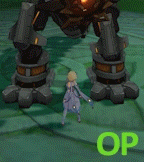

### 随机倍攻 

更改一次攻击能造成随机的几次伤害。

- 会覆盖上面的`倍率`。
- 仅在`秒杀模式`关闭的情况下生效。

#### 倍功最小值 

调整随机倍攻的最小值。

- 范围: 1 ~ 1000

#### 倍功最大值 

调整随机倍攻的最大值。

- 范围: 2 ~ 1000

------

### 普攻范围 

使周围的生物承受被攻击的生物受到的伤害。

- 伤害仅会显示在被攻击的生物上。
- 类似于ID伤害。

#### 范围 (米) 

设定生效范围 (米) 。

- 范围: 5 ~ 50

------

### 多重动画 

使角色的攻击动画重复播放 并对怪物造成多次伤害。

- 现版本 此功能无法生效。

#### 多重动画倍率 

- 现版本 此功能无法生效。

#### 动画状态 

- 现版本 此功能无法生效。

------

### 攻击速度 

角色在攻击时加快角色的速度。

- 如果在角色攻击时关闭 则角色会一直保持攻击时的速度。

#### 速度倍率 

- 范围: 1 ~ 5

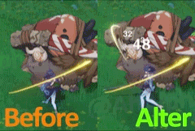

------

### 自定义元素 

使角色造成的所有伤害为指定元素。

- 一共有三种模式: `随机元素类型`以及`元素队列模式`。
- 若要关闭此功能则需切换场景。

### 随机元素类型 

随机选择造成伤害的元素类型。

- 会覆盖下面的`元素类型`。
- 随机选择11种: 火 水 草 雷 冰 冰封 风 岩 免疫 枫丹小艇反冻结 未知

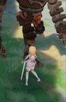

### 元素类型 

指定造成伤害的元素类型。

- 可指定12种: 无 火 水 草 雷 冰 冰封 风 岩 免疫 枫丹小艇反冻结 未知

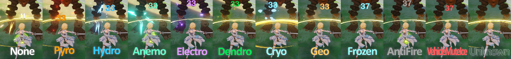

### 元素队列模式 

自定义造成伤害的元素类型的顺序。

- 会覆盖上面的`元素类型`。

#### 添加 

添加`元素类型`选择的元素至列表最后。

#### 清除 

删除列表所有项。

#### 移除最后一个 

删除列表中最后一项。

### 无攻击时自动重置队列 (ms) 

经过`设定的时间` (ms) 没有任何角色造成伤害后下一次攻击将从列表第一项开始。

范围: 1000 ~ 600000

### 延迟切换元素 (ms) 

切换元素后需要经过`设定的时间` (ms) 才能进行下一次切换。

范围: 1 ~ 1000

------

### 自动弱点 

使某些生物承受弓箭角色的攻击时都在主要位置上。

- 现版本 此功能无法生效。

## 自动奔跑 

> 自动以相机的视角方向移动。

### 启用 

是否启用`自动奔跑`。

- 启用时 角色的行走、奔跑以及跳跃等动作会出现异常。

### 速度 

调整`自动奔跑`的速度。

- 范围: 0.01 ~ 1000

## 命座修改器 

> 激活所选角色的所有命座。

### 启用 

是否启用`命座修改器`。

- 至Bkebi-1.0.2起 此功能仅Debug构建。
- 可能需要在队伍配置让角色重新上场或者切换地图以生效。
- 仅少数命座有效 生效的命座可参考至: (@Strigger) [[Info\] Working Constellations](https://discord.com/channels/1026295403282436097/1073556189817864193) 。

### 命座 

选择角色以使其所有命座激活。

## 冷却效果 

> 调整与冷却有关(如技能、蓄力等)的冷却效果。

### 满元素爆发能量 

实际上是使元素爆发不再需要能量。

- 依旧不会处于一直满能量状态 可以积攒能量且使用元素爆发后会被清空。
- 左侧会强制显示所有角色的充能图标 有可能会显示已充能能量。

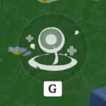

### 减少 战技/爆发 冷却时间 

使元素战技/元素爆发的冷却时间调试为`所设定的数值`-1(秒)。

- 范围: 1 ~ 6

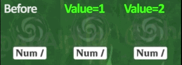

### 无冲刺冷却时间 

使角色可以无限连续冲刺。

### 弓箭瞬间蓄力 

使弓箭角色的元素蓄力瞬间完成。

- 某些弓箭角色需要等待举弓时的一段瞬间开始蓄力。
- 目前会导致菲谢尔无法射出箭矢。
- 如有角色瞬间蓄力无效 请在 [此Discord频道](https://discord.com/channels/1026295403282436097/1073216872931151922) 上提供反馈。

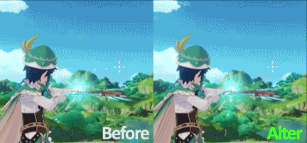

### 技能日志[调试] 

全局技能记录。

- 仅记录最近的50条。

## 坠落控制 

> 使角色坠落时可以使用 `W` `S` `A` `D` 水平运动。

### 启用 

是否启用`坠落控制`。

### 速度 

设置角色坠落时的水平运动速度。

- 范围: 0 ~ 100

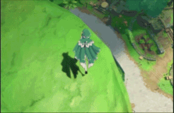

## 攻击队友 

> 使你可以伤害其他玩家。

### 启用 

是否启用`攻击队友`。

- 属于实体伤害。
- 此功能仅Debug构建。

### 初始化 

 • ?加载其他玩家的实体。

### 重置 

 • ?重置实体。

## 无敌模式 

> 使角色不会受到任何伤害。

### 无敌模式 

使角色不会受到来自生物、坠落以及环境的任何伤害。

- 至Bkebi-1.0.3起 此功能无法免疫摔落伤害。

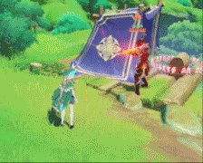

#### 触发条件 

设置启用`无敌模式`的前置条件。

#### 最小生命值 

设定百分比超过上场角色生命值百分比时才可触发`无敌模式`。

- 范围: 0.1 ~ 100

#### 攻击闪避率 

设定值触发`无敌模式`的百分比概率。

- 范围 0 ~ 100

### 不死 

免疫环境伤害，并闪避所有大于角色当前血量的其他数值伤害。

### 无摔落 

免疫摔落伤害。

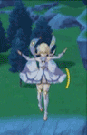

## 无限体力 

> 使角色的体力不再减少。

### 启用 

使冲刺、攀爬、游泳、飞行不再消耗体力。

- 有可能造成无法冲刺、攀爬、飞行等 需要重启游戏以恢复。

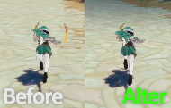

#### 阻止上传模式(更安全) 

会拦截冲刺、攀爬、飞行等体力消耗动作的服务器数据包。

- 联机时队友会看到你的角色行为异常 如抽搐等。

## 自由移动 

> 替换原有移动机制 使角色可以在世界中自由移动。

### 启用 

是否启用`自由移动`。

- 联机时自己会看到队友异常移动。
- 队友可能不能看到你在空中飞行 而只是在地上行走。
- 默认按键: `W` - 向前移动 | `S` - 向后移动 | `A` - 向左移动 | `D` - 向右移动 | `Space` - 向上移动(相对角色) | `LCtrl` - 向下移动(相对角色)

### 允许在空中释放技能 

使角色启用自由移动后可以一直保持如站立、坠落、游泳、飞行等动作状态。

- (使角色在空中可以保持站立状态而不会进入坠落状态。)
- 需要在站立状态下启用`自由移动`才可以在空中释放技能。

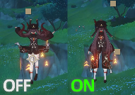

### 速度 

设置自由移动的速度。

- 范围: 2 ~ 100

### 相对相机方向移动 

使用 `W` `S` `A` `D` 或 `自定义按键` 控制时相对于相机方向 而不是角色朝向。

### 备用自由移动 

按住 `LCtrl` 或 `自定义按键` 使用`自由移动`时不会使用上面的`速度`而是改用下面的`变速`。

### 变速 

设置备用自由移动速度。

- 范围: 2 ~ 100

### 加速度模式(暂) 

使用速度而不是位置来移动。

- 目前作用未知。

### 自由飞行模式 

不移除碰撞体。

- 在速度过慢时 你可能无法穿过部分地形。

### 使用自定义按键 

指定`自由移动`的按键。

### 防拉回 

在运动过快时 使用原地传送防止服务器拉回。

## 远程工具 

> 在没有合成台的情况下执行合成相关的请求。

### 合成浓缩树脂 

快速合成一次浓缩树脂。

- 合成成功会直接进入背包 不会有任何提示。

### 生成合成台 

立即在前方生成一座合成台。

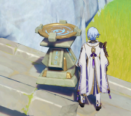

### 热键 

指定`远程工具`的按键。

### 自定义请求 

自定义合成请求。

#### 合成ID 

使用指定`合成ID`执行合成。

- 可在`合成表`中的`combineId`列 获取`合成ID`。

#### 数量 

指定执行合成的数量。

#### 合成 

执行一次指定`数量`和`合成ID`的合成请求。

- 合成成功会直接进入背包 不会有任何提示。

> 参考文档：
>   * [一篇动漫游戏作弊端的大概收集 & 简单介绍。](https://ahalpha.github.io/Anime_Game_Ha-k_Docs/cheat/bkebi-gc/01_player.html)