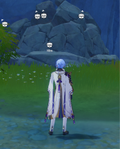
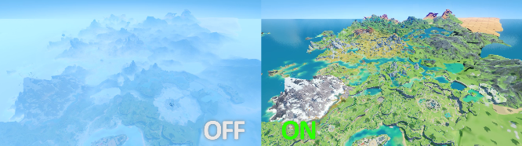
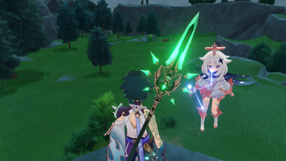
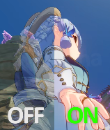

# 视图

更改部分与显示有关的内容。

### 宝箱指示器

强制启用大部分宝箱的指示机制。

### 显示技能冷却

在右侧显示元素战技的技能冷却时间与其可用次数。

- 多人游戏下不可看见队友的技能冷却情况。

### 去雾

去除所有迷雾。

### 隐藏界面

隐藏一些游戏界面 包括游戏中界面与派蒙界面。

- 可能会导致一些会暂停游戏的界面中画面异常 此时需要关闭此项。

### 反虚化

使被摄像机靠近的角色不会被虚化。

### 派蒙跟随

使派蒙在菜单关闭后不会被隐藏。

- 传送后可能会使派蒙消失 需要重新打开和关闭一次菜单。

- 多人游戏下队友不可见。

## 动画修改器

可自定义播放角色的指定动画。

### 启用

是否启用[**`动画修改器`**](#动画修改器)。

### 动画

设定将要播放的动画。

- 不同的上场角色会有不同的[**`动画`**](#动画)选项。
- 可选择: 
  - `ActivitySkill_CustomSkill01` 无风之翼的飞行动画。
  - `ActivitySkill_CustomSkill02` 无风之翼的飞行动画。
  - `ActivitySkill_ElectricCoreFly` 飞行动画。&nbsp;(队友可见)&nbsp;
  - `ActivitySkill_GrapplingHook` 使用四叶印状态。&nbsp;(队友可见)&nbsp;
  - `AimLoop` 瞄准状态(仅限弓箭角色)。&nbsp;(队友可见)&nbsp;
  - `Akimbo02AS` 拍照时的叉腰动作取消。&nbsp;(队友可见)&nbsp;
  - `Akimbo02BS` 拍照时的叉腰动作开始并持续。&nbsp;(队友可见)&nbsp;
  - `Akimbo02Loop` 拍照时的叉腰动作持续。&nbsp;(队友可见)&nbsp;
  - `Attack01` 普通攻击第一段(仅限非弓箭角色)。&nbsp;(队友可见)&nbsp;
  - `Attack02` 普通攻击第二段(仅限非弓箭角色)。&nbsp;(队友可见)&nbsp;
  - `Attack03` 普通攻击第三段(仅限非弓箭角色)。&nbsp;(队友可见)&nbsp;
  - `Attack04` 普通攻击第四段(仅限非弓箭角色)。&nbsp;(队友可见)&nbsp;
  - `Attack05` 普通攻击第五段(仅限非弓箭角色)。&nbsp;(队友可见)&nbsp;
  - `AquariaBlade_Melee` 
  - `AquariaBlade_Melee_AS`
  - `AquariaBlade_Range`
  - `AquariaBlade_Range_AS`
  - `ChannelAS` 风佑之羽球解除使用状态。&nbsp;(队友可见)&nbsp;
  - `ChannelBS` 风佑之羽球开始使用并持续状态。&nbsp;(队友可见)&nbsp;
  - `ChannelLoop` 风佑之羽球持续使用状态。&nbsp;(队友可见)&nbsp;
  - `ClimbDownToGround` 攀爬落地状态。
  - `Climbldle` 攀爬状态。
  - `ClimbJump` 攀爬时跳跃。
  - `ClimbMove0` 攀爬移动状态。
  - `ClimbMove1` 攀爬移动状态。
  - `CrouchDrop` 下落状态。
  - `Crouchldle` 
  - `CrouchMove` 
  - `CrouchRoll` 
  - `CrouchToStandby` 站起动作。
  - `DropDown` 下落状态。
  - `ExtraAttack` 重击动作。&nbsp;(队友可见)&nbsp;
  - `ExtraAttack_AS` 重击结束动作。&nbsp;(队友可见)&nbsp;
  - `FallDie` 坠落死亡动作。
  - `FallDie_AS` 坠落死亡动作。
  - `FallOnGround` 落地动作。
  - `FallOnGroundLit` 低高度落地动作。
  - `FallToGroundRun` 落地向前跑。
  - `FallToGroundRunHard` 落地翻滚动作、
  - `FallToGroundSprint` 落地冲刺动作。
  - `FallingAnthem_AS_1` 下落攻击落地动作。&nbsp;(队友可见)&nbsp;
  - `FallingAnthem_AS_2` 下落攻击落地结束动作。&nbsp;(队友可见)&nbsp;
  - `FallingAnthem_BS_1` 下落攻击开始动作。&nbsp;(队友可见)&nbsp;
  - `FallingAnthem_BS_2` 下落攻击中动作。&nbsp;(队友可见)&nbsp;
  - `FallingAnthem_Loop` 下落攻击持续动作。&nbsp;(队友可见)&nbsp;
  - `FallingAnthem_Loop_Low` 低高度下落攻击持续动作。&nbsp;(队友可见)&nbsp;
  - `FastAimLoop`
  - `Fly` 飞行动画。
  - `FlyStart` 展开风之翼的飞行动画。
  - `FrozenWindmil` 元素爆发动画(神里凌华)。&nbsp;(队友可见)&nbsp;
  - `FrozenWindmill_AS` 元素爆发结束动画(神里凌华)。 &nbsp;(队友可见)&nbsp;
  - `Gandalfr_Attack01`
  - `Gandalfr_Attack02`
  - `Gandalfr_Attack03`
  - `Gandalfr_Attack04`
  - `Gandalfr_Attack05`
  - `Gandalfr_Attack06`
  - `Gandalfr_End`
  - `Gandalfr_End_AS`
  - `Gandalfr_ExtraAttack`
  - `Gandalfr_ExtraAttack_AS`
  - `Gandalfr_Start`
  - `Gandalfr_Start_AS`
  - `HitGroundDie` 被攻击死亡动画。
  - `Hit_H` 被重击。
  - `Hit_L` 被攻击。
  - `Hit_Throw` 被击飞。
  - `Hit_ThrowAir` 被击飞。
  - `Hit_Throw_Ground` 被击飞。
  - `Icespine` 元素战技动画。&nbsp;(队友可见)&nbsp;
  - `Icespine_Out` 元素战技结束动画。&nbsp;(队友可见)&nbsp;
  - `Jump` 跳跃。
  - `JumpForRun` 跑步时跳跃。
  - `JumpForSprint` 冲刺时跳跃。
  - `JumpForWalk` 行走时跳跃
  - `JumpOffWall` 取消攀爬时跳跃。
  - `JumpUpWallForStandby` 准备攀爬状态。
  - `JumpUpWallReady` 准备攀爬状态。
  - `LiquidStrike_AS` 冲刺结束动画(神里凌华)。&nbsp;(队友可见)&nbsp;
  - `LiquidStrike_AS_OnWater` 冲刺结束动画(神里凌华)。&nbsp;(队友可见)&nbsp;
  - `LiquidStrike_BS` 冲刺结束动画(神里凌华)。&nbsp;(队友可见)&nbsp;
  - `LiquidStrike_BS1` 冲刺动画(神里凌华)。&nbsp;(队友可见)&nbsp;
  - `LiquidStrike_BS_0` 冲刺结束动画(神里凌华)。&nbsp;(队友可见)&nbsp;
  - `LiquidStrike_FatalMove` 冲刺动画(神里凌华)。&nbsp;(队友可见)&nbsp;
  - `LiquidStrike_FatalStandby` 冲刺动画(神里凌华)。&nbsp;(队友可见)&nbsp;
  - `LiquidStrike_Move` 冲刺动画(神里凌华)。&nbsp;(队友可见)&nbsp;
  - `LiquidStrike_MoveStandby` 冲刺动画(神里凌华)。&nbsp;(队友可见)&nbsp;
  - `LiquidStrike_Strike` 冲刺下落攻击动画。
  - `NormalDie` 一般死亡动作。
  - `PlayMusic_Drum_AS` 绮筵之鼓结束使用动作。&nbsp;(队友可见)&nbsp;
  - `PlayMusic_Drum_BS` 绮筵之鼓开始使用并持续动作。&nbsp;(队友可见)&nbsp;
  - `PlayMusic_Drum_Loop` 绮筵之鼓持续动作。&nbsp;(队友可见)&nbsp;
  - `PlayMusic_Lyre_AS` 风物之诗琴结束使用动作。&nbsp;(队友可见)&nbsp;
  - `PlayMusic_Lyre_BS` 风物之诗琴开始使用并持续动作。&nbsp;(队友可见)&nbsp;
  - `PlayMusic_Lyre_Loop` 风物之诗琴持续动作。&nbsp;(队友可见)&nbsp;
  - `PlayMusic_Qin_AS` 镜花之琴结束使用动作。&nbsp;(队友可见)&nbsp;
  - `PlayMusic_Qin_BS` 镜花之琴开始使用并持续动作。&nbsp;(队友可见)&nbsp;
  - `PlayMusic_Qin_Loop` 镜花之琴持续动作。&nbsp;(队友可见)&nbsp;
  - `Run` 跑动作。
  - `RunToldle` 停止跑动作。
  - `RunToWalk` 跑到走动作。
  - `ShootRunBS` 
  - `ShootStandbyBS` 
  - `ShowUp` 落地动作。
  - `SitBDown` 坐下开始并持续动作。
  - `SitBLoop` 坐下持续动作。
  - `SitBUp`
  - `SitDown`
  - `SitLoop`
  - `SitUp`
  - `SkiffNormal`
  - `SlipBackWall`
  - `SlipFaceWall`
  - `Sprint`
  - `SprintBS`
  - `SprintToldle`
  - `SprintToRun`
  - `Standby`
  - `Standby2ClimbA`
  - `Standby2ClimbB`
  - `StandbyPutaway`
  - `StandbyShow_01`
  - `StandbyShow_02`
  - `StandbyVoice`
  - `StandbyWeapon`
  - `Struggle`
  - `SwimDash`
  - `SwimDie`
  - `Swimldle`
  - `SwimJump`
  - `SwimJumpDrop`
  - `SwimJumpToWater`
  - `SwimMove`
  - `Tartaglia_Attack01`
  - `Tartaglia_Attack02`
  - `Tartaglia_Attack03`
  - `Tartaglia_Attack04`
  - `Tartaglia_Attack05`
  - `Tartaglia_Attack06`
  - `Think01AS`
  - `Think01BS`
  - `Think01Loop`
  - `TurnDir`
  - `Upstairs`
  - `Walk`
  - `WalkToldle`
  - `WalkToRun`
  - *(and more...)*

### 延迟

设置按住时的动画间隔或连点时的最小间隔。

- 设定的快捷键不为 `None` 时 仅在按住 [**`-`**](#) 时播放[**`动画`**](#动画)。

- 设定的快捷键为 `None` 时 一直播放[**`动画`**](#动画)。

- 设定的快捷键不为 `None` 时 仅在按住 [**`-`**](#) 时重置动画。

- 设定的快捷键为 `None` 时 一直重置动画。

## 浏览器

## 无限视距

## 自定义资料卡

## 自定义天气

## 表情修改器

## FPS帧率解锁

## 风之翼

## 自由相机

## 皮肤修改器

## 纹理修改器
  > 参考文档：
>   * [一篇动漫游戏作弊端的大概收集 & 简单介绍。](https://ahalpha.github.io/Anime_Game_Ha-k_Docs/cheat/bkebi-gc/05_visuals.html)