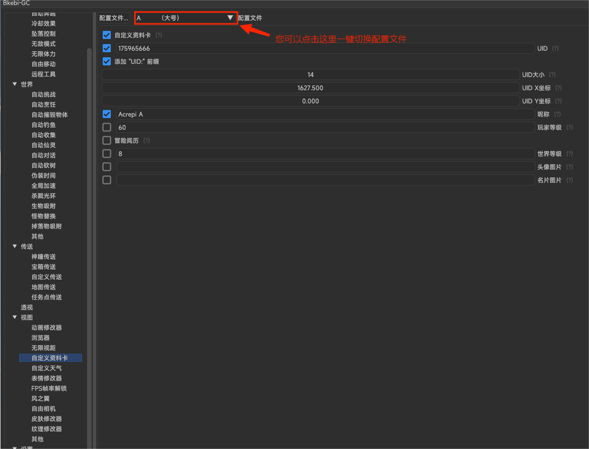
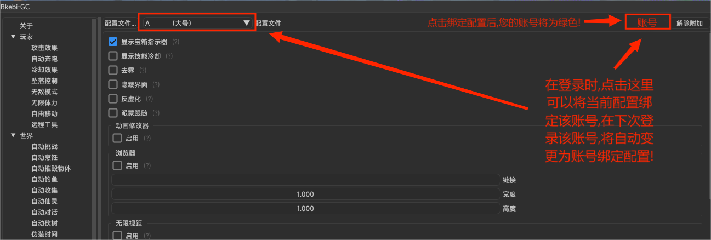

# 配置

> Bkebi 支持多种配置文件切换和绑定，先简单介绍一下这两项功能。

## 切换

开启辅助后在功能界面的左上方切换配置

## 绑定

如果您不想每一次上号都进行一次切换配置，那么您可以对配置文件进行绑定

## 配置模板

Bkebi 的使用多种多样，有些旅行者可能因为自己胡乱调整配置导致抓进小黑屋里，所以这里列举一些配置模板进行参考。但是请注意，收益和风险总是并存，所以，怕别开，开别怕。

模板来源“[Bkebi中文使用图文教程1.0](https://www.kdocs.cn/l/csNDRjijraFk)”，并打包好了配置文件[下载](https://wwzb.lanzoue.com/iO3w90lzx51g)。

### A配置--大号使用

* 玩家类
  * 多重攻击（5-7倍随机倍数）
  * 无限E/Q（满元素爆发能量）
  * 弓箭瞬间蓄力
  * 无限体力（拦截包发包模式）
  * 无敌模式（触发条件 15%最小生命值时无敌，平时有30%概率闪避伤害）
  * 自由移动（25倍加速）

* 世界类
  * 自动挑战、炸药桶自动爆炸（20m，延时2000ms）
  * 加速烹饪、快速精通烹饪
  * 自动摧毁物体 矿物、植物(蒲公英等)、杂物（木箱等）（距离5m）
  * 自动钓鱼（拉杆延时2200重杆延时500）
  * 自动收集、自动宝箱（拾取速度250ms+随机拾取延迟350ms）
  * 拾取范围增加（5m）
  * 自动对话、自动选择对话选项、剧情加速*10（长按快捷键F 开启/关闭）
  * 自动砍树（350ms攻击延时、500ms重复延时、每棵树攻击次数3、范围8m）
  * 全局加速（长按快捷键鼠标侧前 开启/关闭）
  * 杀戮光环（坠落伤害模式、百分比模式击败次数5 、间隔延迟300、循环延迟1800）

* 视图
  * 透视默认显示（U按钮显示/关闭）
  * 自定义资料卡（UID尾号666昵称Acrepi A）
  * FPS帧率解锁（前台60、后台10）
  * 风之翼（苍天清风之翼）
  * 皮肤修改器（全选 此功能需要您看功能详情）
  * 显示宝箱指示器

* 其他
  * FPS显示
  * 传送目标显示

### B配置--小号使用

* 玩家类
  * 多重攻击 秒杀模式
  * 无限E/Q（满元素爆发能量）
  * 弓箭瞬间蓄力
  * 无限体力拦截包发包模式
  * 无敌模式（触发条件 30%最小生命值时无敌，平时有50%概率闪避伤害）
  * 自由移动30倍加速

* 世界类
  * 自动挑战、炸药桶自动爆炸（20m，延时2000ms）
  * 加速烹饪、快速精通烹饪
  * 自动摧毁物体 矿物、植物(蒲公英等)、杂物（木箱等）（距离10m）
  * 自动钓鱼（拉杆延时2000重杆延时500）
  * 自动收集、自动宝箱（拾取速度450ms+随机拾取延迟500ms）
  * 拾取范围增加（5m）
  * 自动对话、自动选择对话选项、剧情加速*15（长按快捷键F 开启/关闭）
  * 自动砍树（350ms攻击延时、500ms重复延时、每棵树攻击次数3、范围12m）
  * 全局加速（长按快捷键鼠标侧上 开启/关闭）
  * 杀戮光环（坠落伤害模式、百分比模式击败次数3 、间隔延迟300、循环延迟1800）
* 视图
  * 透视默认显示（U按钮显示/关闭）
  * 自定义资料卡（UID尾号777 昵称Acrepi B）
  * FPS帧率解锁（前台60、后台10）
  * 风之翼（森郁花絮之翼）
  * 皮肤修改器（全选 此功能需要您看功能详情）
  * 显示宝箱指示器
* 其他
  * FPS显示
  * 传送目标显示

### online配置--多人联机使用

[为什么联机需要单独配置?](QA?id=q：为什么联机需要单独配置)

* 玩家类
  * 多重攻击多重攻击（5-7倍随机倍数）
  * 无限E/Q（满元素爆发能量 减少）
  * 弓箭瞬间蓄力
  * 无敌模式（触发条件 10%最小生命值时无敌，平时有35%概率闪避伤害）
  * 自由移动25倍加速（按鼠标侧下 开启/关闭）
* 世界类
  * 加速烹饪、快速精通烹饪
  * 自动摧毁物体 矿物、植物(蒲公英等)、杂物（木箱等）（距离8m）
  * 自动钓鱼（拉杆延时2500重杆延时500）
  * 拾取范围增加（5m）
  * 自动砍树（350ms攻击延时、500ms重复延时、每棵树攻击次数3、范围15m）
* 视图
  * 透视默认显示（U按钮显示/关闭）
  * 自定义资料卡（UID尾号888昵称Acrepi B）
  * FPS帧率解锁（前台60、后台10）
  * 风之翼（苍天情分之翼）
  * 皮肤修改器（全选 此功能需要您看功能详情）
  * 显示宝箱指示器
* 其他
  * FPS显示
  * 传送目标显示

### SY配置--深渊

* 杀戮光环（坠落伤害模式、百分比模式击败次数28 、间隔延迟1000、循环延迟2000）

PS：深渊风险极高，不推荐使用 Bkebi 。如果需要使用，尽量控制时间、伤害、承受伤害等，说白了，就是需要当“演员”。

### TP配置--自动传送

* 无敌模式
* 杀戮光环（即死模式、间隔延迟300、循环延迟2000）
* 自动砍树（300ms攻击延时、800ms重复延时、每棵树攻击次数3、范围15m）
* 拾取范围增加（20m）
* 自动拾取、自动宝箱、自动交互（随机时间450ms+450ms）
* 自由移动默认开启
* 生物吸附（速度3.5、范围25m、距离1.5m） 
* 自动传送默认间隔25秒