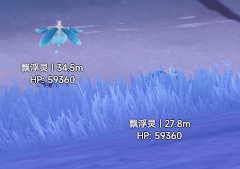

# 透视

> 使你能够看见万物的方向。

------

## 通用

基本设定。

#### 启用透视

是否启用`透视`。

#### 范围 (米)

设定`透视`的有效范围。

#### 绘制模式

设定绘制的样式。

- 可选择: `无` `矩形` `盒子` `四角盒子`

#### 追踪模式

设定追踪的样式。

- 可选择: `无` `线` `离屏箭头`

#### 填充 边框/长方形/箭头

将会填充`边框`、`长方形`与`箭头`。

#### 填充透明度

更改`填充 边框/长方形/箭头`的透明度。

#### 设置追踪点为屏幕中心

将`线`追踪从屏幕中间开始 而不是从角色底部。

#### 显示名称

是否显示绘制对象的昵称。

#### 显示距离

是否显示绘制对象的距离。

#### 显示生命值

是否显示绘制对象的生命值。

#### 隐藏已完成的解密

隐藏已完成的解谜 如元素方碑、蓬蓬果、雷灵等。

#### 字体大小

设定绘制字体大小。

- 设定较大的字体大小有可能会导致本地游戏崩溃！

#### 字体描边大小

是否启用绘制字体的描边。

### 全局颜色

覆盖所有颜色为指定颜色。

#### 字体颜色

设定所有绘制的字体为指定颜色。

#### 边框颜色

设定所有对象的`盒子`与`四方盒子`绘制样式为指定颜色。

#### 追踪颜色

设定所有对象的追踪样式为指定颜色。

#### 长方形颜色

设定所有对象的`矩形`绘制样式为指定颜色。

## 可用透视对象

### 宝箱

- 可选择: `普通的宝箱` `精致的宝箱` `珍贵的宝箱` `华丽的宝箱` `奇馈宝箱` `调查点` `石摩拉箱`
- 提示: 
  - `左键`勾选是否启用 `右键`更换对应项的颜色。
  - `搜索物品`仅支持英文搜索 可在此处使用(Ctrl+F)中文搜索来定位指定物品。
  - 每项物品均支持设定快捷键快速控制是否显示。
  - 此处`提示`下同。

### 收集

- 可选择: `书籍` `观景点` `旋曜玉帛` `书页` `任务交互` `木箱子` `岩之印`

### 收集品

- 可选择: `风神瞳` `绯红玉髓` `草神瞳` `雷神瞳` `雷种子` `垂钓点` `岩神瞳` `掉落道具` `键纹 |` `流明晶石` `圣章石` `地灵龛` `限时挑战`

### 指南

- 可选择: `弹弹菇` `火炬` `众叶觉蕊` `昼夜切换机制` `草种子` `三相众物` `草石块` `渊下宫相位之门` `神秘的刻像` `相位之门` `精华拜受处` `锅` `遗迹之烛` `松散的沙堆` `「雷石」` `三角的机关`

### 生物

- 可选择: `队友` `自己` `狸猫` `鸟蛋` `野猪` `蝴蝶翅膀` `猫` `螃蟹` `蓝翎露` `乌鸦` `晶核` `狗` `暝彩鸟` `鰻鰻` `茶羽鹰` `金团雀` `鱼肉` `狐狸` `青蛙` `狗` `狐狸` `蜥蜴尾巴` `吉光虫` `发光髓` `NPC` `鬼兜虫` `鸽子` `鍬鳅` `圣金虫` `松鼠` `星螺` `盗宝鼬` `鸭子`

### 矿物

- 可选择: `紫晶矿` `老石` `石珀` `水晶矿` `晶化骨髓` `龙牙` `电气水晶` `铁矿` `夜泊石` `魔晶块` `深赤之石` `星银矿石` `白铁块`

### 怪物

- 可选择: `北风狼` `若陀龙王` `风魔龙` `女士` `雷电将军` `正机之神殿` `达达利亚` `急冻树` `掣电树` `爆炎树` `无相之风` `无相之冰` `无相之雷` `无相之草` `无相之岩` `无相之水` `无相之火` `深海龙蜥·啮冰` `深海龙蜥·吞雷` `古岩龙蜥` `纯水精灵` `雷音权现` `恒常机关阵列` `遗迹巨蛇` `黄金王兽` `魔偶剑鬼` `兆载永劫龙兽` `半永恒统辖矩阵` `翠翎恐蕈` `风蚀沙虫` `深渊法师` `黑蛇骑士` `圣骸飞蛇` `圣骸赤鹫` `圣骸毒蝎` `飞萤` `深渊咏者·紫电` `镀金旅团` `狂风之核` `债务处理人` `莹术士` `藏镜仕女` `愚人众先遣队` `浮游水蕈兽` `飞蛇` `岩龙蜥` `幼岩龙蜥` `陆行水本真蕈` `丘丘人` `深渊使徒·激流` `深海龙蜥·原种` `海乱鬼` `千岩军` `丘丘暴徒` `武士` `幻形豕兽·水` `幻形蟹·水` `幻形鹤·水` `幻形飞鹰·水` `幻形雀·水` `幻形蛙·水` `幻形花鼠·水` `幻形游禽·水` `元能构装体` `深渊咏者·渊火` `兽境猎犬` `兽境幼犬` `长鬓虎` `遗迹龙兽` `遗迹重机` `遗迹守卫` `遗迹猎手` `遗迹机兵` `丘丘萨满` `珊瑚宫成员` `毒蝎` `黯色空売` `牦牦驮兽` `幕府足轻` `史莱姆` `飘浮灵` `棘冠鳄` `伸缩蕈兽` `盗宝团` `奇怪的丘丘人` `秃鹰` `旋转蕈兽` `骗骗花` `陆行真蕈`

### 植物

- 可选择: `枣椰` `天云草实` `苹果` `竹笋` `树莓` `嘟嘟莲` `胡萝卜` `塞西莉亚花` `蒲公英种子` `血斛` `烈焰花` `幽灯蕈` `琉璃百合` `香辛果` `赤念果` `马尾` `绝云椒椒` `劫波莲` `董瓜` `莲蓬` `松茸` `薄荷` `冰雾花` `蘑菇` `鸣草` `月莲` `帕蒂沙兰` `慕风蘑菇` `松果` `清心` `白萝卜` `树王圣体菇` `绯樱绣球` `沙脂蛹` `珊瑚珍珠` `海灵芝` `海草` `霓裳花` `小灯草` `金鱼草` `须弥蔷薇` `日落果` `甜甜花` `落落莓` `琉璃袋` `「毗波耶」` `风车菊` `钩钩果` `墩墩桃`

### 解密

- 可选择: `雪山大冰矿` `狸猫` `蓬蓬果` `解谜魔方` `八块石板` `电气传导` `雷灵` `元素方碑` `恒光元件` `风史莱姆` `岩种子` `岩方碑` `神秘的壁画` `大岩石` `雷霆探针` `发光的地板解谜` `流明原石` `流明仙灵` `小船(暂)` `荒野中的苗圃` `淤泥涌口` `幻梦之门` `海盗船指针(清籁丸)` `压力石板` `元能火种` `元能尖碑` `元能沙钟` `聚电石` `能量提取装置` `键纹锁` `仙灵` `仙灵座` `小石碓` `石柱封印` `风屏障` `须弥解密` `剑柄` `手鞠` `死域` `限时收集挑战` `火炬解谜` `三相众物` `奇特的岩石` `温暖仙灵` `风车`