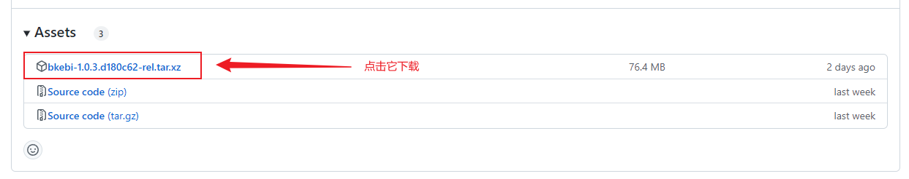
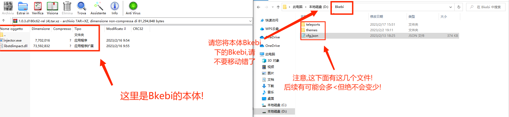
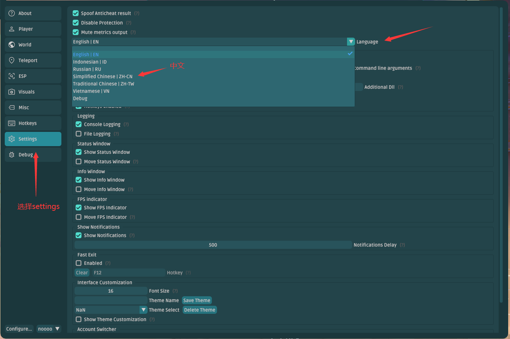

# 快速开始

## 下载程序

首先你需要下载 Bkebi 的本体程序，前往[这个链接](https://github.com/Bkebi-Group/Bkebi-GC-Release/releases/latest)可以获取最新的版本，点击结尾为`tar.xz` 的链接进行下载。`tar.xz`是一个压缩格式，所以你需要一个解压软件进行解压，因软件不同，你可能需要解压两次。最终你找到下面两个文件：

* injector.exe
* libstdimpact.dll

将这两个文件解压出来放在**非原神根目录、非桌面、非中文路径**的任意文件夹中（推荐使用空文件夹），我们就完成了下载解压步骤了。

> 如果访问和下载速度慢，你可能需要开启网络加速器，此处不作多余说明。

## 初次使用

1. 在**关闭原神**的情况下，双击打开(需要**管理员权限**)`injector.exe` 启动 Bkebi 。
   > 如果没有反应和注入失败，你应当检查是否被安全杀毒软件拦截，此时你应当将 Bkebi 添加进杀毒软件白名单或者直接关闭杀毒软件。

2. 第一次使用需要指定游戏程序路径，请在弹出的“Select genshin path”中选择路径。
   > 一般情况下，原神游戏文件夹处于启动器文件夹中“Genshin Impact Game”中，国服请在里面找到 Yuanshen.exe 选择并确认，国际服的名称应该选择 GenshinImpact.exe 

3. 在这里取得你的HWID

4. 前往[Discord#keygen](https://discord.com/channels/1026295403282436097/1079048003001782342)使用/generate free

5. 取得你的密钥文件并放置在libstdimpact.dll同目录

3. 然后点击`Retry`即可进入游戏。

## 使用建议

1. 拾取宝箱速度不宜过快，建议是连续开启两个宝箱可以间隔3s左右，两个以后，也就是当您想连续的开启第三个宝箱时，请间隔至少20s！
2. 秘境奖励领取时间、世界Boss奖励领取时间不宜过快，我们的建议是至少间隔20s！
3. 深渊通关不宜过快，深渊是米哈游重点调查的项目。

## 更换界面语言（可选）

1. 初次使用进入游戏后，Bkebi 应该会自行打开功能界面，如果没有出现，可以使用默认快捷键`F1`打开
2. 在左侧列表中下拉找到 “Settings” 点击打开，之后在右侧找到 “Language” 的下拉菜单，在里面选择你需要使用的语言即可，暂时我们支持以下语言：
   * English | EN | 英语
   * Russian | RU | 俄语
   * Simplified Chinese | ZH-CN | 简体中文
   * Traditonal Chinese | ZH-TW | 繁体中文

