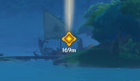

# 传送

> 如何快速跑图。

------

## 宝箱传送

> 检查周围选定宝箱或见闻的有效点位并传送。

### 就近传送

使用指定按键传送到最近的选定有效点位。

- 若有有效点位 则会在`信息面板`-`传送`-`神瞳`显示有效点位的距离。

### 显示信息

在信息窗口显示关于最近宝箱的简易信息。

- 现版本 此功能不能关闭。

### 过滤器

设定`宝箱传送`的生效类型。

#### 过滤类型

设定需要检测的宝箱或见闻。

- 可选择: `宝箱` `调查` `书页` `唱片` `任务交互` `地脉之花` `未知`

#### 品质过滤器

设定需要检测的宝箱品质。

- 需要在`过滤类型`中勾选宝箱才能启用勾选。

- 可选择: `普通` `精致` `珍贵` `华丽` `奇馈`

#### 状态过滤器

设定需要检测的宝箱状态。

- 需要在`过滤类型`中勾选宝箱才能启用勾选。

- 可选择: `锁定` `岩封` `冰封` `在荆棘中` `陷阱`

### 道具

显示周围所有选定宝箱或见闻的有效点位。

- 可以点击`Teleport`传送到指定的点位。

------

## 自定义传送 Pro

> 创建或加载自定义点位进行传送。

### 启用

是否启用`自定义传送`。

### 自动传送

自动根据传送点位顺序传送接下来的每一个点位。

#### 智能传送

无视配置文件的队列顺序，取离你最近的点位传送。

#### 近距离传送延迟减少

如果两个点位距离<60m 则会通过设定的倍率来减少传送的间隔时间。

- 例:  设置为0.5x，原来传送时间为20秒时，当距离<60m，这个时间会被减少到10秒，0.25x则是5秒

### 随机延迟

使用随机延迟自动传送。

- 此选项将覆盖`延迟时间(秒)`。

#### 最小延迟 (秒)

设定自动传送的最小延迟。

#### 最大延迟 (秒)

设定自动传送的最大延迟。

### 延迟时间(秒)

设定自动传送的延迟。

### 传送下一个

使用快捷键快速传送点下一个点位。

### 快速添加当前位置到当前数据

按下按键记录当前坐标到配置文件中。

### 自动传送结束执行命令

在自动传送的所有点位传送完成后执行一次命令行。

#### 命令行

自动传送完成时，自动执行命令行。

- 例:  shutdown -s -t 60  (一分钟后关闭计算机)

#### 文件列表

管理传送文件。

- 可加载第三方传送文件 有关获取传送文件以及更多信息请移步至 [自定义传送](CustomTeleport.md) 。

> 注意：新版不支持旧版本传送，同时文件格式将不再是json，而是加密过的bpfc

#### 名称

设定将要创建的传送文件的昵称。

#### 描述

设定将要创建的传送文件的昵称。

#### 添加传送文件

创建一个名为`名称`描述为`名称`的传送文件。

#### 打开文件夹

使用文件管理器打开传送文件的文件夹。

#### 当前传送文件

目前正在使用的传送文件。

#### 搜索

搜索筛选传送文件。

#### 选择

选择此项传送文件进行准备传送。

#### 重置传送记录

重置此项传送文件里所有点位的传送记录。

#### 删除文件

删除此线传送文件。

### 传送点位

管理 当前传送文件 的所有传送点位。

- 点击 传送 即可传送到对应项的位置。

- X Y Z 即为点位数据。

- 若使用传送点位 则 已传送 会标记为 是。

------

## 地图传送

> 在地图上使用`鼠标左击`一键传送。

### 启用

是否启用`地图传送`。

### 使用原坐标

在传送建筑物或锚点时使用系统默认传送位置 而不是指定的绝对位置。

### 指定高度

在无法获取到地面高度时 会将您传送到此设定的高度。

### 传送键

设定使用`地图传送`的前置按键。

- 设定的快捷键不为 `None` 时 需要在按住`传送键`时使用`鼠标左击`传送。

- 设定的快捷键为 `None` 时 仅使用`鼠标左击`即可传送。

------

## 神瞳传送

> 检查周围神瞳的有效点位并传送。

### 就近传送

使用指定按键传送到最近的有效点位。

- 若有有效点位 则会在`信息面板`-`传送`-`神瞳`显示有效点位的距离。

- 在没有有效点位时将不会进行传送。

### 神瞳 列表

显示周围所有神瞳的有效点位。

- 可以点击`Teleport`传送到指定的点位。

------

## 任务点传送

> 按下快捷键快速传送到任务追踪目标。

### 任务点传送

是否启用`任务点传送`。

### 传送快捷键

- 设定的快捷键为 `None` 时 `任务点传送`将无法生效。