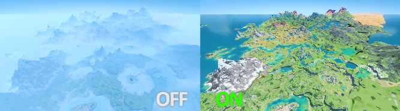

# 视图

> 更改部分与显示有关的内容。

------

## 其他

### 显示宝箱指示器

更长距离的宝箱，游戏机制提示。

### 显示技能冷却

在右侧显示元素战技的冷却时间与其可用次数。

- 多人游戏下不可看见队友的技能冷却情况。
- 关闭后贴图不会立即消失，需要传送一次。

### 去雾

去除所有雾类特效。

### 隐藏界面

隐藏一些游戏界面 包括游戏中界面与派蒙界面。

- 可能会导致一些会暂停游戏的界面中画面异常 此时需要关闭此项。
- UID不会被隐藏，需要的可以使用自定义资料卡

### GM 图标

显示GM工具图标

### 反虚化

使被摄像机靠近的角色不会被虚化。

### 派蒙跟随

使派蒙在菜单关闭后不会被隐藏。

- 传送后可能会使派蒙消失 需要重新打开和关闭一次菜单。
- 多人游戏下队友不可见。

-----

## 动画修改器

可自定义播放角色的指定动画。

### 启用

是否启用`动画修改器`。

### 动画

设定将要播放的动画。

- 不同的上场角色会有不同的`动画`选项。
- 可选择: 
  - `ActivitySkill_CustomSkill01` 无风之翼的飞行动画。
  - `ActivitySkill_CustomSkill02` 无风之翼的飞行动画。
  - `ActivitySkill_ElectricCoreFly` 飞行动画。&nbsp;(队友可见)&nbsp;
  - `ActivitySkill_GrapplingHook` 使用四叶印状态。&nbsp;(队友可见)&nbsp;
  - `AimLoop` 瞄准状态(仅限弓箭角色)。&nbsp;(队友可见)&nbsp;
  - `Akimbo02AS` 拍照时的叉腰动作取消。&nbsp;(队友可见)&nbsp;
  - `Akimbo02BS` 拍照时的叉腰动作开始并持续。&nbsp;(队友可见)&nbsp;
  - `Akimbo02Loop` 拍照时的叉腰动作持续。&nbsp;(队友可见)&nbsp;
  - `Attack01` 普通攻击第一段(仅限非弓箭角色)。&nbsp;(队友可见)&nbsp;
  - `Attack02` 普通攻击第二段(仅限非弓箭角色)。&nbsp;(队友可见)&nbsp;
  - `Attack03` 普通攻击第三段(仅限非弓箭角色)。&nbsp;(队友可见)&nbsp;
  - `Attack04` 普通攻击第四段(仅限非弓箭角色)。&nbsp;(队友可见)&nbsp;
  - `Attack05` 普通攻击第五段(仅限非弓箭角色)。&nbsp;(队友可见)&nbsp;
  - `AquariaBlade_Melee` 
  - `AquariaBlade_Melee_AS`
  - `AquariaBlade_Range`
  - `AquariaBlade_Range_AS`
  - `ChannelAS` 风佑之羽球解除使用状态。&nbsp;(队友可见)&nbsp;
  - `ChannelBS` 风佑之羽球开始使用并持续状态。&nbsp;(队友可见)&nbsp;
  - `ChannelLoop` 风佑之羽球持续使用状态。&nbsp;(队友可见)&nbsp;
  - `ClimbDownToGround` 攀爬落地状态。
  - `Climbldle` 攀爬状态。
  - `ClimbJump` 攀爬时跳跃。
  - `ClimbMove0` 攀爬移动状态。
  - `ClimbMove1` 攀爬移动状态。
  - `CrouchDrop` 下落状态。
  - `Crouchldle` 
  - `CrouchMove` 
  - `CrouchRoll` 
  - `CrouchToStandby` 站起动作。
  - `DropDown` 下落状态。
  - `ExtraAttack` 重击动作。&nbsp;(队友可见)&nbsp;
  - `ExtraAttack_AS` 重击结束动作。&nbsp;(队友可见)&nbsp;
  - `FallDie` 坠落死亡动作。
  - `FallDie_AS` 坠落死亡动作。
  - `FallOnGround` 落地动作。
  - `FallOnGroundLit` 低高度落地动作。
  - `FallToGroundRun` 落地向前跑。
  - `FallToGroundRunHard` 落地翻滚动作、
  - `FallToGroundSprint` 落地冲刺动作。
  - `FallingAnthem_AS_1` 下落攻击落地动作。&nbsp;(队友可见)&nbsp;
  - `FallingAnthem_AS_2` 下落攻击落地结束动作。&nbsp;(队友可见)&nbsp;
  - `FallingAnthem_BS_1` 下落攻击开始动作。&nbsp;(队友可见)&nbsp;
  - `FallingAnthem_BS_2` 下落攻击中动作。&nbsp;(队友可见)&nbsp;
  - `FallingAnthem_Loop` 下落攻击持续动作。&nbsp;(队友可见)&nbsp;
  - `FallingAnthem_Loop_Low` 低高度下落攻击持续动作。&nbsp;(队友可见)&nbsp;
  - `FastAimLoop`
  - `Fly` 飞行动画。
  - `FlyStart` 展开风之翼的飞行动画。
  - `FrozenWindmil` 元素爆发动画(神里凌华)。&nbsp;(队友可见)&nbsp;
  - `FrozenWindmill_AS` 元素爆发结束动画(神里凌华)。 &nbsp;(队友可见)&nbsp;
  - `Gandalfr_Attack01`
  - `Gandalfr_Attack02`
  - `Gandalfr_Attack03`
  - `Gandalfr_Attack04`
  - `Gandalfr_Attack05`
  - `Gandalfr_Attack06`
  - `Gandalfr_End`
  - `Gandalfr_End_AS`
  - `Gandalfr_ExtraAttack`
  - `Gandalfr_ExtraAttack_AS`
  - `Gandalfr_Start`
  - `Gandalfr_Start_AS`
  - `HitGroundDie` 被攻击死亡动画。
  - `Hit_H` 被重击。
  - `Hit_L` 被攻击。
  - `Hit_Throw` 被击飞。
  - `Hit_ThrowAir` 被击飞。
  - `Hit_Throw_Ground` 被击飞。
  - `Icespine` 元素战技动画。&nbsp;(队友可见)&nbsp;
  - `Icespine_Out` 元素战技结束动画。&nbsp;(队友可见)&nbsp;
  - `Jump` 跳跃。
  - `JumpForRun` 跑步时跳跃。
  - `JumpForSprint` 冲刺时跳跃。
  - `JumpForWalk` 行走时跳跃
  - `JumpOffWall` 取消攀爬时跳跃。
  - `JumpUpWallForStandby` 准备攀爬状态。
  - `JumpUpWallReady` 准备攀爬状态。
  - `LiquidStrike_AS` 冲刺结束动画(神里凌华)。&nbsp;(队友可见)&nbsp;
  - `LiquidStrike_AS_OnWater` 冲刺结束动画(神里凌华)。&nbsp;(队友可见)&nbsp;
  - `LiquidStrike_BS` 冲刺结束动画(神里凌华)。&nbsp;(队友可见)&nbsp;
  - `LiquidStrike_BS1` 冲刺动画(神里凌华)。&nbsp;(队友可见)&nbsp;
  - `LiquidStrike_BS_0` 冲刺结束动画(神里凌华)。&nbsp;(队友可见)&nbsp;
  - `LiquidStrike_FatalMove` 冲刺动画(神里凌华)。&nbsp;(队友可见)&nbsp;
  - `LiquidStrike_FatalStandby` 冲刺动画(神里凌华)。&nbsp;(队友可见)&nbsp;
  - `LiquidStrike_Move` 冲刺动画(神里凌华)。&nbsp;(队友可见)&nbsp;
  - `LiquidStrike_MoveStandby` 冲刺动画(神里凌华)。&nbsp;(队友可见)&nbsp;
  - `LiquidStrike_Strike` 冲刺下落攻击动画。
  - `NormalDie` 一般死亡动作。
  - `PlayMusic_Drum_AS` 绮筵之鼓结束使用动作。&nbsp;(队友可见)&nbsp;
  - `PlayMusic_Drum_BS` 绮筵之鼓开始使用并持续动作。&nbsp;(队友可见)&nbsp;
  - `PlayMusic_Drum_Loop` 绮筵之鼓持续动作。&nbsp;(队友可见)&nbsp;
  - `PlayMusic_Lyre_AS` 风物之诗琴结束使用动作。&nbsp;(队友可见)&nbsp;
  - `PlayMusic_Lyre_BS` 风物之诗琴开始使用并持续动作。&nbsp;(队友可见)&nbsp;
  - `PlayMusic_Lyre_Loop` 风物之诗琴持续动作。&nbsp;(队友可见)&nbsp;
  - `PlayMusic_Qin_AS` 镜花之琴结束使用动作。&nbsp;(队友可见)&nbsp;
  - `PlayMusic_Qin_BS` 镜花之琴开始使用并持续动作。&nbsp;(队友可见)&nbsp;
  - `PlayMusic_Qin_Loop` 镜花之琴持续动作。&nbsp;(队友可见)&nbsp;
  - `Run` 跑动作。
  - `RunToldle` 停止跑动作。
  - `RunToWalk` 跑到走动作。
  - `ShootRunBS` 
  - `ShootStandbyBS` 
  - `ShowUp` 落地动作。
  - `SitBDown` 坐下开始并持续动作。
  - `SitBLoop` 坐下持续动作。
  - `SitBUp`
  - `SitDown`
  - `SitLoop`
  - `SitUp`
  - `SkiffNormal`
  - `SlipBackWall`
  - `SlipFaceWall`
  - `Sprint`
  - `SprintBS`
  - `SprintToldle`
  - `SprintToRun`
  - `Standby`
  - `Standby2ClimbA`
  - `Standby2ClimbB`
  - `StandbyPutaway`
  - `StandbyShow_01`
  - `StandbyShow_02`
  - `StandbyVoice`
  - `StandbyWeapon`
  - `Struggle`
  - `SwimDash`
  - `SwimDie`
  - `Swimldle`
  - `SwimJump`
  - `SwimJumpDrop`
  - `SwimJumpToWater`
  - `SwimMove`
  - `Tartaglia_Attack01`
  - `Tartaglia_Attack02`
  - `Tartaglia_Attack03`
  - `Tartaglia_Attack04`
  - `Tartaglia_Attack05`
  - `Tartaglia_Attack06`
  - `Think01AS`
  - `Think01BS`
  - `Think01Loop`
  - `TurnDir`
  - `Upstairs`
  - `Walk`
  - `WalkToldle`
  - `WalkToRun`
  - *(and more...)*

### 延迟

设置按住时的动画间隔或连点时的最小间隔。

### 调试动画

记录当前前台角色的动画状态

------

## 浏览器

创建游戏内浏览器

- 链接 `设定生成的浏览器显示的链接`
- 宽度 `设定生成的浏览器宽度`
- 宽度 `设定生成的浏览器高度`

------

## 无限视距

> 自定义摄像头距离角色的远近。

### 启用

是否启用 `无限视距`

移动时候尽头会归正到最大视距。

- 固定视距 `给相机设置一个固定的附加视距值`

- 最大视距 `设置相机的最大视距半径比`

- 最小视距 `设置相机的最小视距半径比`

- 切换速度 `设置相机的视距速度乘数`

  - 注意:该数值很灵敏，可能会产生问题，最好设置为1 

### 视场修改

自定义视场大小

------

## 自定义资料卡

> 自定义修改本地的个人游戏信息。

### 自定义资料卡

是否启用自定义资料卡。

- 此功能的所有修改均仅限本地有效 其他玩家不能看到任何修改。

- 文本类自定义可使用颜色代码 相关工具: [gradientlt](https://gradient-it.vercel.app/) 。

### UID

设定自己的全局UID显示。

- 可作用于自己的派蒙菜单、名片以及右下角等UID显示界面。

### 添加"UID:"前缀

在右下角的UID处添加`UID: `前缀。

- 不会影响其他的UID显示界面。

### UID大小

自定义右下角的UID大小。

- 在分辨率为`1080P`时 默认值为`14`。

### UID X坐标

自定义右下角的水平位置。

- 在分辨率为`1080P`时 默认值为`1860`。

### UID Y坐标

自定义右下角的垂直位置。

- 在分辨率为`1080P`时 默认值为`0`。

### 昵称

设定昵称显示。

- 可作用于自己的名片、派蒙菜单以及旅行者名字等昵称显示界面。

- 多人联机时 不可作用于用`F2`打开的联机列表。

### 玩家等级

设定冒险等阶显示。

- 可作用于自己派蒙菜单的冒险等阶显示界面。

- 不可作用于屏幕顶部弹出和名片。

- 目前会覆盖资料卡的昵称显示。

### 冒险阅历

设定冒险阅历显示。

- 可作用于自己派蒙菜单的冒险阅历显示。

- 显示结果为`当前经验值/最大经验值`。

- 不会修改冒险阅历经验条。

#### 当前经验值

更改显示的现有经验值。

#### 最大经验值

更改显示的最大经验值。

### 冒险阅历经验条 (冒险阅历经验条数值)

自定义冒险阅历的经验条数值的进度。(百分比)

- 不会修改冒险阅历。

### 世界等级

设定世界等级显示。

- 可作用于自己派蒙菜单的世界等级显示。

### 头像图片

设定派蒙菜单的头像显示。

- 指定本地文件路径。

- 照片大小分辨率必须为`256x256`。

### 名片图片

设定派蒙菜单的名片显示。

- 指定本地文件路径。

- 照片大小分辨率必须为`840x400`。

------

## 自定义天气

> 设定当前世界的天气。

### 启用

是否启用`自定义天气`。

### 天气种类

设定`天气种类`。

- 可选择: 晴天 多云 雾天 暴风 大雨 喷泉雨 雪光 东海岸

### 闪电

闪电目标设置为敌人，适用于雷暴天气。

------

## 表情修改器

> 可以自定义让角色播放指定表情。

### 启用

是否启用`表情修改器`。

- 多人游戏下 仅自己可见。

#### 口型

设定将要播放的口型。

- 可选择:
  - `P_A`
  - `P_A01`
  - `P_A_01` 较大张嘴。
  - `P_Angry01`
  - `P_Angry02`
  - `P_Angry03` 露出牙齿。
  - `P_Angry04`
  - `P_Angry05`
  - `P_Angry_01` 不开心的表情。
  - `P_Angry_02` 不开心的表情。
  - `P_Angry_03` 不开心/露出牙齿。
  - `P_Angry_04` 不开心/张嘴。
  - `P_Angry_05` 不开心/较大张嘴。
  - `P_Default`
  - `P_Default01`
  - `P_Default_01`
  - `P_Delta01`
  - `P_Delta02`
  - `P_Doya01`
  - `P_Doya02`
  - `P_Doya03`
  - `P_Doya_01` 歪嘴/笑。
  - `P_Doya_02` 尴尬/露出牙齿。
  - `P_Doya_03` 尴尬/较大张嘴。
  - `P_E`
  - `P_E01`
  - `P_E_01` 吃惊/张嘴。
  - `P_Fury01`
  - `P_Fury_01` 吃惊/较大张嘴。
  - `P_I`
  - `P_I01`
  - `P_I_01` 笑容/椭圆的嘴/露出牙齿。
  - `P_Line01`
  - `P_N`
  - `P_N01`
  - `P_N_01` 有一点不开心的表情。
  - `P_Neko01`
  - `P_Neko02` 猫猫嘴巴。
  - `P_Neko_01` 猫猫嘴巴。
  - `P_Neko_02` 猫猫嘴巴。
  - `P_None`
  - `P_Normal01`
  - `P_Normal_01` 平常的表情。
  - `P_O`
  - `P_O01`
  - `P_O_01` O形张嘴。
  - `P_Pero01`
  - `P_Pero02`
  - `P_Pero_01` 原神派蒙图标里的表情。
  - `P_Pero_02` 吐舌头。
  - `P_Smile01`
  - `P_Smile02`
  - `P_Smile03`
  - `P_Smile04`
  - `P_Smile05`
  - `P_Smile06`
  - `P_Smile_01` 笑容。
  - `P_Smile_02`笑容。
  - `P_Smile_03` 笑容/露出牙齿。
  - `P_Smile_04` 笑容/张嘴。
  - `P_Smile_05` 笑容/较大张嘴。
  - `P_Square01`
  - `P_TalkAngry01`
  - `P_TalkAngry02`
  - `P_TalkAngry03`
  - `P_TalkAngry121`
  - `P_TalkAngry122`
  - `P_TalkAngry131`
  - `P_TalkAngry132`
  - `P_TalkAngry221`
  - `P_TalkAngry222`
  - `P_TalkAngry231`
  - `P_TalkAngry232`
  - `P_TalkAngry321`
  - `P_TalkAngry322`
  - `P_TalkAngry331`
  - `P_TalkDelta01`
  - `P_TalkDoya01`
  - `P_TalkNone01`
  - `P_TalkNone02`
  - `P_TalkNone03`
  - `P_TalkNone04`
  - `P_TalkNormal121`
  - `P_TalkNormal122`
  - `P_TalkNormal131`
  - `P_TalkNormal132`
  - `P_TalkNormal221`
  - `P_TalkNormal222`
  - `P_TalkNormal231`
  - `P_TalkNormal232`
  - `P_TalkNormal321`
  - `P_TalkNormal322`
  - `P_TalkNormal331`
  - `P_TalkSmile01`
  - `P_TalkSmile02`
  - `P_TalkSmile03`
  - `P_TalkSmile04`
  - `P_TalkSmile121`
  - `P_TalkSmile122`
  - `P_TalkSmile131`
  - `P_TalkSmile132`
  - `P_TalkSmile221`
  - `P_TalkSmile222`
  - `P_TalkSmile231`
  - `P_TalkSmile232`
  - `P_TalkSmile321`
  - `P_TalkSmile322`
  - `P_TalkSmile331`
  - `P_TalkSquare01`
  - `P_Talk_Angry_121` 伤心的表情。
  - `P_Talk_Angry_122`伤心的表情。
  - `P_Talk_Angry_131` 伤心的表情。
  - `P_Talk_Angry_132` 伤心的表情。
  - `P_Talk_Angry_221` 伤心的表情。
  - `P_Talk_Angry_222` 伤心的表情。
  - `P_Talk_Angry_231` 伤心的表情。
  - `P_Talk_Angry_232` 伤心的表情。
  - `P_Talk_Angry_321` 伤心的表情。
  - `P_Talk_Angry_322` 伤心的表情。
  - `P_Talk_Angry_331` 伤心的表情。
  - `P_Talk_Normal_121` 平常的表情。
  - `P_Talk_Normal_122` 平常的表情。
  - `P_Talk_Normal_131` 平常的表情。
  - `P_Talk_Normal_132` 平常的表情。
  - `P_Talk_Normal_221` 平常的表情。
  - `P_Talk_Normal_222` 平常的表情。
  - `P_Talk_Normal_231` 平常的表情。
  - `P_Talk_Normal_232` 平常的表情。
  - `P_Talk_Normal_321` 平常的表情。
  - `P_Talk_Normal_322` 平常的表情。
  - `P_Talk_Normal_331` 平常的表情。
  - `P_Talk_Smile_121` 开心的表情。
  - `P_Talk_Smile_122` 开心的表情。
  - `P_Talk_Smile_131` 开心的表情。
  - `P_Talk_Smile_132` 开心的表情。
  - `P_Talk_Smile_221` 开心的表情。
  - `P_Talk_Smile_222` 开心的表情。
  - `P_Talk_Smile_231` 开心的表情。
  - `P_Talk_Smile_232` 开心的表情。
  - `P_Talk_Smile_321` 开心的表情。
  - `P_Talk_Smile_322` 开心的表情。
  - `P_Talk_Smile_331` 开心的表情。
  - `P_U`
  - `P_U01`
  - `P_U_01` 小圆嘴。

#### 情绪

设定将要播放的情绪。

- 可选择:
  - `Normal`
  - `Anger`
  - `Happy`
  - `Fear`
  - `Sad`
  - `Disgust`
  - `Surprise`
  - `Puzzled`
  - `EyeClosed`
  - `Shy`
  - `Serious`
  - `Naughty`
  - `Wink`
  - `Laugh`
  - `Hope`
  - `Upset`
  - `Tired`
  - `Sweat`
  - `Angry01`
  - `Angry02`
  - `Angry03`
  - `Angry04`
  - `Angry05`
  - `Angry06`
  - `Closed01`
  - `Closed02`
  - `Closed03`
  - `Closed04`
  - `Closed05`
  - `Happy01`
  - `Happy02`
  - `Hannv03`
  - `Happy04`
  - `Happy05`
  - `Normal01`
  - `Normal02`
  - `Normal03`
  - `Normal04`
  - `Normal05`
  - `Normal06`
  - `Sad01`
  - `Sad02`
  - `Sad03`
  - `Sad04`
  - `Sad05`
  - `Surprise01`
  - `Surprise02`
  - `Surprise03`
  - `Surprise04`
  - `Surprise05`
  - `Sweat01`
  - `Sweat02`
  - `Sweat03`
  - `Sweat04`
  - `Sweat05`
  - `Tired01`
  - `Tired02`
  - `Tired03`
  - `Tired04`
  - `Tired05`
  - `None`
  - `Default`
  - `Angry_01` 生气。
  - `Angry_02` 生气。
  - `Angry_03` 生气。
  - `Angry_04` 生气。
  - `Default_01` 默认。
  - `Doubt_01` 虚眼。
  - `Doubt_02` 虚眼。
  - `Doubt_03` 虚眼。
  - `Doubt_04` 虚眼。
  - `Gentle_01` 不开心。
  - `Gentle_02` 不开心。
  - `Gentle_03` 不开心。
  - `Gentle_04` 不开心。
  - `HiClosed_01` ^_^/闭眼。
  - `HiClosed_02` ^_^/闭眼。
  - `HiClosed_03` ^_^/闭眼。
  - `HiClosed_04` ^_^/闭眼。
  - `HiClosed_05` ^_^/闭眼。
  - `HiClosed_06` ^_o/闭左眼。
  - `HiClosed_07` o_^/闭右眼。。
  - `LowClosed_01` v_v/闭眼。
  - `LowClosed_02` v_v/闭眼。
  - `LowClosed_03` v_v/闭眼。
  - `LowClosed_04` v_v/闭眼。
  - `LowClosed_05` v_v/闭眼。
  - `LowClosed_06` v_o/闭左眼。
  - `LowClosed_07` o_v/闭右眼。
  - `MidClosed_01` -_-/闭眼。
  - `MidClosed_02` -_-/闭眼。
  - `MidClosed_03` -_-/闭眼。
  - `MidClosed_04` -_-/闭眼。
  - `MidClosed_05` -_-/闭眼。
  - `MidClosed_06` -_o/闭左眼。
  - `MidClosed_07` o_-/闭右眼。
  - `Normal_01` 日常的表情。
  - `Normal_02` 日常的表情。
  - `Normal_03` 日常的表情。
  - `Normal_04` 日常的表情。
  - `Normal_05` 日常的表情。
  - `Surprise_01` 惊讶的表情。
  - `Surprise_02` 惊讶的表情。
  - `Sweat_01` 流汗的表情。
  - `Sweat_02` 流汗的表情。
  - `Sweat_03` 流汗的表情。
  - `Sweat_04` 流汗的表情。

------

## FPS帧率解锁

> 与游戏帧率相关的设定。

### 帧率

设定游戏的最高帧率。

### 限制后台FPS

游戏在非前台状态下的FPS。

- 在Bkebi-GC主菜单打开的情况下将会失效。

- 屏幕正在加载时也会失效。

------

## 风之翼

> 替换所有角色的风之翼样式。

### 启用

是否启用风之翼。

- 多人游戏下 仅自己可见。

#### 风之翼类型

设定替换后的风之翼类型。

可选择: `初始之翼` `守候之翼` `降临之翼` `苍天清风之翼` `金琮天行之翼` `雪隐之翼` `飨宴之翼` `雷腾云奔之翼` `星汉灿烂之翼` `森郁花繁之翼`

------

## 自由相机

> 使镜头脱离角色并替换原有机制进行自由控制。

### 启动

是否启用`自由相机`。

### 冻结角色动作

停止当前角色的动作。

- 多人游戏下 不会影响其他玩家的角色。

- 此功能不会受到启动的控制。

### 隐藏角色

隐藏当前上场角色。

- 多人游戏下 不会隐藏其他玩家的角色。

- 此功能不会受到启动的控制。

### 拦截用户输入

在使用自由相机时 将无法使用任何按键控制游戏中的内容。

### 设置

有关`自由相机`的设置。

#### 移动速度

在使用 `W` `S` `A` `D` 等控制镜头移动时 镜头的移动速度。

#### 视角灵敏度

在使用 `鼠标` 控制镜头视角方向时 视角移动的灵敏度。

#### 滚动速度

在使用 `Z` `X` `C` 控制镜头拍摄角度时 角度旋转的速度。

#### 视野速度

在使用 `1` `3` 控制镜头视野范围时 视野范围改变的速度。

#### 视野范围

FoV，镜头的可视范围。

可使用 `1` `3` 控制的镜头视野范围。

#### 将FoV转换到35mm全片幅焦距

利用视野范围(FoV)根据内参计算当前焦距。

#### 移动平滑度

在使用 `W` `S` `A` `D` 等控制镜头移动时 镜头移动的平滑度。

越低越平滑。

#### 视角平滑度

在使用 `鼠标` 控制镜头视角方向时 视角移动的平滑度。

越低越平滑。

#### 滚动平滑度

在使用 `Z` `X` `C` 控制镜头拍摄角度时 角度旋转的平滑度。

越低越平滑。

#### FOV平滑度

在使用 `1` `3` 控制镜头视野范围时 视野范围改变的平滑度。

越低越平滑。

### 热键

设定`自由相机`的快捷键。

默认按键: `W` - 前 | `S` - 后 | `A` - 左 | `D` - 右 | `Space` - 上 | `LeftCtrl` - 下 | `Z` - 左滚动 | `X` - 右滚动 | `C` - 重置滚动 | `3` - 增加FOV | `1` - 减少FOV

------

## 菜单解锁器

> 强制解锁某些菜单

### 派蒙菜单

解锁派蒙菜单项。

### 区域限制

解锁区域限制(红色限制圆圈)。

- 不是大世界的边界

## 皮肤修改器

> 选择的皮肤将会直接装备给对应的角色。

### 启用

是否启用`皮肤修改器`。

- 需要更换到需要生效的角色然 队伍配 - 后置让角色重新上场。

- 若一个角色选择了多个皮肤 则仅最前面的角色生效。

- 可生效于头像和角色展柜 仅自己可见。

- 多人游戏下 仅自己可见。

- 可选择: `神里绫华：花时来信` `琴：海风之梦` `琴：古恩希尔德的传承` `丽莎：叶隐芳名` `芭芭拉：闪耀协奏` `迪卢克：殷红终夜` `安柏：100%侦察騎士` `凝光：纱中幽兰` `菲谢尔：极夜真梦` `莫娜：星与月之约` `刻晴：霓裾翩跹` `罗莎莉亚：致教会自由人`

------

## 纹理修改器

> 修改当前角色的纹理

### 启用

是否启用`纹理修改器`。

#### 头部

- 头部纹理。    
示例路径: C:\Head.png

#### 身体

- 身体纹理。    
路径示例: C:lBody.png

#### 穿着

- 穿着纹理。     
示例路径: C:\Dress.png

#### 风之翼

- 风之翼纹理。      
示例路径: C:IGlider.png