# 世界

> "`Hallo World`"零基础教程，三分钟从入门到入土。

------

## 其他

### 立即打开队伍界面

在打开队伍配置时 将不会有2秒的非战斗等待时间。

### 跳过强化动画

跳过武器和圣遗物的等级提升对话框。

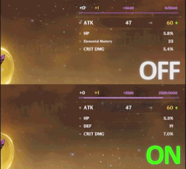

#### 显示升级信息对话框

显示圣遗物提升到 `+4` `+8` `+12` `+16` `+20` 时的等级提升对话框。

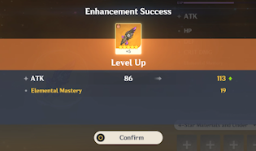

### 敌人变傻

所有魔物将不会对玩家发起任何攻击行为。

- 多人游戏下仅限成为[**`联机主要者`**](/CO-OP_Master.md)时生效。

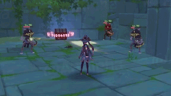

### 冻结敌人

停止所有魔物的动作。

- 多人游戏下仅限成为[**`联机主要者`**](/CO-OP_Master.md)时生效 但在任何情况下你都不会被怪物击中。

### 永久元素视野

元素视野将保持启用状态。

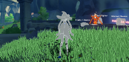

-----

## 自动挑战

> 自动收集元素微粒等挑战道具。

### 启用

是否启用`自动挑战`。

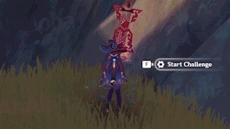

### 引爆炸药桶

自动引爆炸药桶。

- 风险未知！

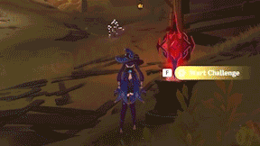

### 自定义挑战

收集指定的道具。

#### 启用自定义挑战

是否启用`自定义挑战`。

#### 显示的昵称

指定此项在列表中的名称。

#### 道具ID

指定需要收集的道具的`道具ID`。

- 可在`调试`-`显示的昵称`-`实体管理器`中`ID`列获取周围道具的`道具ID`。

#### 添加

添加名称为`显示的昵称`的一项 用于收集ID为`道具ID`的道具。

------

## 自动烹饪

> 快速完成烹饪操作。

### 启用

是否启用`自动烹饪`。

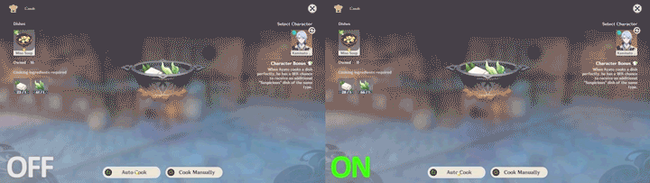

### 快速熟练

尽可能快速的将一份未解锁自动烹饪的食物解锁自动烹饪。

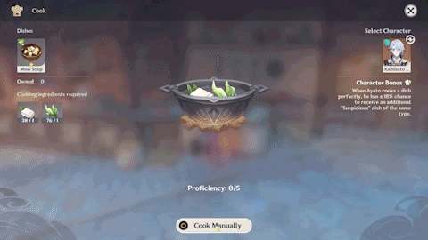

### 质量

指定手动烹饪的食物成品质量。

- 可选择: `美味的` `普通` `奇怪的`

------

## 自动摧毁物体

> 自动摧毁非生物类物体。

### 启用

是否启用`自动摧毁物体`。

- 可选类型: 
  - `矿物` 矿物及其变种 包括电气水晶、晶化骨髓等。
  - `护盾` 深渊法师/深渊使徒/史莱姆的护盾。
  - `杂物` 桶、箱、花瓶等。
  - `特殊对象` 雪山大冰块、大小石堆。
  - `特殊宝箱` 宝箱上的荆棘、冰块、石头。
    - 此项可能会摧毁地脉花 使其不可见！

#### 范围 (米)

设定`自动摧毁物体`的生效范围。

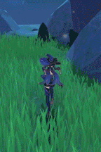

------

## 自动钓鱼

> 当前上钩的鱼立即入包。

### 启用

是否启用`自动钓鱼`。

### 重新抛竿

重置抛竿状态，使你在不重新抛竿的情况下能够继续钓鱼。

- 重置抛竿状态时没有任何提示。

------

## 自动收集

> 自动收集材料、宝箱、神瞳等各种物品。

### 自动拾取

自动拾取掉落物、材料等。

- 类似于自动按 `F` 。

#### 当背包上限时自动关闭

当背包达到上限时关闭`自动拾取`。

### 自动交互

自动交互选定事件。

- 可选类型: 
  - `宝箱` 普通的宝箱、珍贵的宝箱、华丽的宝箱等。
  - `地脉花` 摩拉/经验、主世界/周本boss等。
  - `调查点` 标记为 调查/搜索 的点位等。
  - `任务交互点` 有效的任务交互点。
  - `其他` 书页、唱片等。

### 范围拾取

提升自身的拾取范围。

- 可以直接拾取神瞳 也在`拾取过滤`中配置过滤拾取。
- 宝箱等交互类事件不会显示在拾取列表 但是可以通过`自动交互`拾取到。
- 若需要同时开启`自动拾取`或者`自动交互` 请确保在这两者之后开启`范围拾取` 否则设定范围内的物品可能无法被自动拾取。

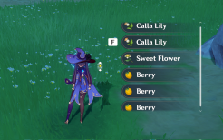

### 拾取速度

设定每一次收集物品的间隔时间。

### 随机拾取延迟

设定每一次收集物品的间隔时间为`随机间隔`。

- `随机间隔` = `延迟时间(毫秒)` ~ {`延迟时间(毫秒)`+`延迟范围+(毫秒)`}

### 拾取过滤

过滤自动拾取的某一些收集物品。

- 启用后未选择的收集物品将不会被自动拾取。

- 可选物品:
  
  - `动物` 鱼、蜥蜴、青蛙、飞行动物。
  - `掉落道具` 材料、矿物、圣遗物。
  - `资源` 除了动物和掉落物品(植物、书籍等)之外的所有东西。
  - `神瞳` 所有神瞳。

------

## 自动解密

> 自动完成某些特殊事件。

### 自动解密

是否启用 自动解密 。

- 可选解密: 
  - `植物` 
  - `仙灵` 
  - `雷灵` 
  - `元素方碑` 
  - `火炬解谜` 
  - `雷霆探针` 
  - `须弥解密` 
  - `死域瘤` 
  - `草石块`
  - `三相众物`
  - `莲莲果` 
  - `风史莱姆` 
  - `岩方碑` 会在解谜周围生成岩种子，需要自行拾取并激活。
  - `参量质变仪` 自动充能参量质变仪。
  - `每日委托` 自动解决一些每日委托， 如清洁污清、落叶等。。
  - `风车`

------

## 自动仙灵

> 使仙灵自动归位。

### 自动仙灵

触碰一次仙灵即可使其归位。

### 自动雷灵

无需触碰雷灵即可使其归位。

- 生效范围为100米。

------

## 自动对话

> 与NPC交互时自动跳过对话。

### 启用

是否启用`自动对话`。

### 切换快捷键

设定切换`自动对话`的快捷键。

- 设定的快捷键不为 `None` 时 仅在按住 `切换快捷键` 时启用`自动对话`。

- 设定的快捷键为 `None` 时 将会一直启用`自动对话`。

### 自动选择对话选项

自动选择对话选项。

- 仅能选择第一项。

#### 排除 凯瑟琳/壶灵/铁匠

与凯瑟琳/壶灵/铁匠对话时 不会自动选择对话选项。

### 对话加速

在对话时启用全局加速。

#### 游戏时间速度

设定对话时的全局速度。

### 强行跳过过场动画

防止对话加速引起的黑屏问题。启用后，过场动画将被强制跳过

### 跳过 CG

自动跳过游戏动画。

------

## 自动砍树

> 自动收集周围的树木。

### 启用

是否启用`自动砍树`。

#### 攻击间隔

每一颗树开始进行砍伐之前的时间间隔。

#### 重复间隔

每一次砍伐的时间间隔。

#### 每棵树攻击次数

- 建议设定为`10`及以下避免过多砍伐造成风险。

- 设定为`0`则为无限制。

- 将在游戏重启后重置。

#### 范围

设定`自动砍树`生效范围。

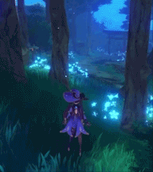

------

## 元素光环

> 对周围的需要特殊元素的实体如一些谜题、收藏品和一些具有元素盾牌的魔物等施加元素。

### 启用元素光环

是否启用 元素光环 。

- 多人游戏下仅限成为 联机主要者 时生效。

### 只作用于仇恨在你身上的对象

仅对目前有仇恨的魔物生效。

### 尝试击中所有物体

使元素光环对非需要特殊元素的实体生效。

### 智慧元素

自动根据实体所需元素类型来选择元素。

- 会覆盖 应用于怪物的元素 以及 应用于物体的元素 。

#### 应用于怪物的元素

对魔物施加的元素。

- 可指定12种: 无 火 水 草 雷 冰 冰封 风 岩 免疫 枫丹小艇反冻结 未知

#### 应用于物体的元素

对世界物体施加的元素。

- 可指定12种: 无 火 水 草 雷 冰 冰封 风 岩 免疫 枫丹小艇反冻结 未知

#### 光环作用范围

设定 元素光环 的生效范围。

#### 队列延迟

寻找到每一个目标之间的间隔。

#### 应用间隔

对目标每一次施加元素的间隔。

#### 元素耐久性

设定元素附着时间。

------

## 伪装时间

> 保持游戏时间在一个固定时间。

### 启用

是否启用`伪装时间`。

- 联机状态下仅自己可见。

- 可以强制更改游戏进门前的场景状态。

### 同步到服务器

同步本地的时间到服务器。

- 联机状态下依旧仅自己可见。

------

## 全局加速

> 加快游戏所有机制的速度。

### 启用

是否启用`全局加速`。

- 多人游戏下仅限成为[**`联机主要者`**](/CO-OP_Master)时生效。

- 多人游戏生效情况下 魔物在队友眼里行为异常 且速度超过`4`后可能无法击中队友。

### 热键

设定切换`全局加速`的快捷键。

- 设定的快捷键不为 `None` 时 仅在按住 `热键` 时启用`全局加速`。

- 设定的快捷键为 `None` 时 将会一直启用`全局加速`。

### 倍率

设定`全局加速`的倍率。

------

## 杀戮光环

> 自动击杀范围内的所有生物。

### 启动 杀戮光环

是否启用`杀戮光环`。

- 一共两种模式: `坠落伤害模式`和`即死模式`。

- 多人游戏下仅限成为[**`联机主要者`**](/CO-OP_Master)时生效。

### 使用AFK攻击

检测范围内的怪物。    
然后传送到那里杀死他们    
它可能比普通的杀戮光环更危险。    
我们为其添加了自动传送功能。    
我们建议传送延迟不少于5秒。   
这是一个不切实际的模块。怪物无法达到一定密度。

### 坠落伤害模式

使用坠落伤害进行攻击。

- 白色无暴击伤害数值提示。

#### 伤害数值 (非百分比模式)

指定伤害数值进行攻击。

#### 击杀次数 (百分比模式)

指定击杀次数推断造成的伤害数值进行攻击。

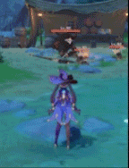

### 即死模式

直接清除实体。

- 无伤害数值提示。

- 可能不会生成掉落物。

- 可能会与无相系列与恒常机关阵列等BOSS发生冲突。

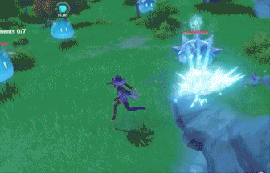

### 伤害间隔延迟(毫秒)

每一次寻找目标之间的间隔时间。

### 伤害循环延迟(毫秒)

每一次攻击之间的间隔时间。

### 杀戮范围

设定`杀戮光环`的生效范围。

### 只作用于仇恨在你身上的对象

仅对目前对你有仇恨的魔物生效。

------

## 生物吸附

> 范围内的选定生物将会移至玩家正前方。

### 启用

是否启用`生物吸附`。

- 多人游戏下大部分吸附效果仅自己可见。

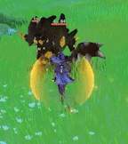

### 怪物 (包括怪物)

是否生效于魔物。

- 可选择: 
  - `普通` 普通类魔物 如丘丘人等。
  - `精英` 精英类魔物 如遗迹守卫等。
  - `Boss` BOSS类魔物 如无相之雷等。

### 动物 (包括动物)

是否生效于动物。

- 可选择: 
  - `掉落型` 死亡后掉落物品的动物 如鸭子等。
  - `直接拾取型` 可以立即拾取的动物 如螃蟹等。
  - `宠物型` 不会被攻击的动物 如猫、狗等。

### 瞬间吸附

使吸附对象立即移动至玩家正前方。

### 移除碰撞器

移除所有实体的碰撞箱 使你无法被任何生物推动。

### 速度

设定吸附速度。

### 范围 (米)

设定`生物吸附`的生效范围。

### 距离(米)

设定生物吸附在玩家正前方的距离。

### 只作用于仇恨在你身上的对象

仅对目前有仇恨的魔物生效。

------

## 怪物替换

> 替换生成的生物为指定生物。

### 启用

是否启用`怪物替换`。

- 在本地生物加载时替换生物。

- 生物的血量和掉落物不会被替换。

- 多人游戏下替换后的生物模型仅自己可见 其他玩家仅能看到替换前的模型。

- 多人游戏下仅限成为[**`联机主要者`**](/CO-OP_Master)时能替换怪物的攻击与技能。

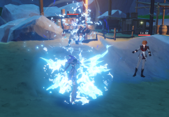

### 排除动物

不替换动物如狗、猫、鸽子等。

### 自定义怪物ID

自定义替换后的`生物ID`。

- 可在[**`GM表`**](https://github.com/ahalpha/Anime_Game_Ha-k_Docs/blob/gh-pages/hack/resources/GM_Handbook.txt)中获取`生物ID`。

### 怪物

在不使用`自定义怪物ID`的情况下使用内置生物。

- 可选择: `丘丘人` `射手丘丘人` `爆弹丘丘人` `丘丘岩盔王` `草丘丘萨满` `大型草史莱姆` `大型风史莱姆` `大型雷史莱姆` `变异雷史莱姆` `大型冰史莱姆` `大型水史莱姆` `大型火史莱姆` `大型岩史莱姆` `深渊咏者·紫电` `幕府足轻` `跋掣` `风魔龙 特瓦林` `奔狼的领主 安德留斯` `愚人众执行官末席「公子」` `邪眼解放「公子」` `「公子」` `若陀龙王` `女士` `焚尽的炽炎魔女` `雷电将军` `雷电影` `祸津御建鸣神命` `「正机之神1」` `「七叶寂照秘密」`

------

## 掉落物吸附

> 范围内的选定掉落物将会移至玩家正前方。

### 启用

是否启用`掉落物吸附`。

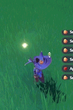

### 延迟时间(毫秒)

每一次移动掉落物的间隔。

### 范围 (米)

设定对普通物品的的生效范围。

### 生物掉落物吸附半径(米)

设定对生物掉落物的的生效范围。

### 距离(米)

设定掉落物吸附在玩家正前方的距离。

### 拾取类型

选择对`掉落物吸附`生效的物品。

- 可选择: 
  - 装备: `圣遗物` `弓` `法器` `双手剑` `剑` `长柄武器`
  - 收集品: `掉落道具`
  - 生物: `晶核` `兽肉` `螃蟹` `鳗鳗` `蜥蜴尾巴` `鱼肉`
  - 矿物: `紫晶矿掉落` `水晶矿掉落` `电气水晶掉落` `铁矿掉落` `夜泊石掉落` `魔晶块掉落` `深赤之石掉落` `星银矿石掉落` `白铁块掉落`
  - 植物: `苹果` `卷心菜` `胡萝卜掉落` `土豆` `白萝卜掉落` `日落果` `小麦`

------